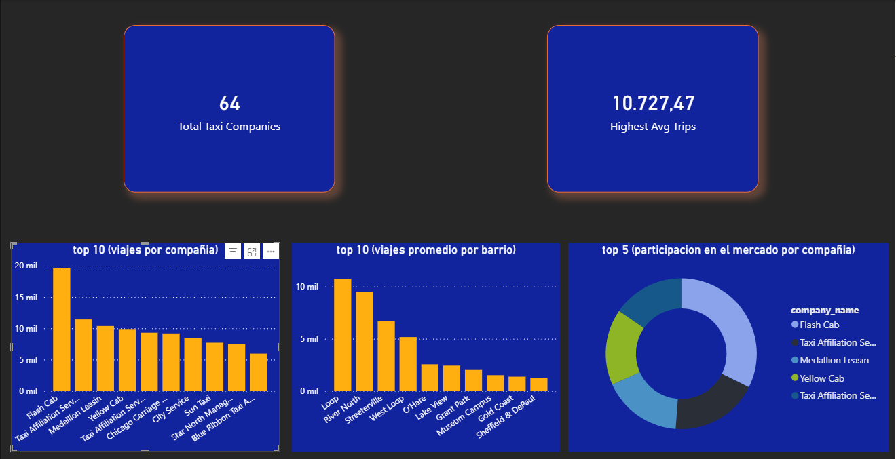

# 🚖 Zuber Data Analysis

This project analyzes ride-sharing and weather data for **Zuber**, a fictional ride-hailing company, to identify ride patterns, market concentration, and demand behavior across neighborhoods.

The analysis combines **SQL**, **Python**, and **Power BI** to transform raw data into actionable business insights.

---

## 🛠️ Tools and Technologies


---

## 🎯 Project Objective

The objective of this project is to explore ride-sharing data and identify:

* The taxi companies with the highest number of trips
* The neighborhoods with the highest ride demand
* Market share distribution among taxi providers
* Demand concentration patterns useful for business decisions

This analysis helps understand how rides are distributed across companies and locations, providing valuable information for operational planning.

---

## 📂 Dataset Description

The project uses three datasets obtained from prior SQL queries:

* **company_trips.csv** → number of trips by taxi company
* **neighborhood_trips.csv** → average trips ending in each neighborhood
* **weather_records.csv** → weather conditions and ride information

These datasets were cleaned and analyzed to identify operational patterns and support business recommendations.

---

## 🔄 Analysis Workflow

1. Extract data using SQL queries
2. Export results into CSV files
3. Clean and validate datasets using Python
4. Perform exploratory analysis
5. Build interactive dashboard in Power BI
6. Generate business insights based on visual analysis

---

## 📊 Dashboard Insights

The dashboard analysis revealed several important patterns:

* **Flash Cab** leads the market with the highest number of trips, outperforming the other taxi companies in the dataset.
* Ride demand is highly concentrated in certain neighborhoods, with **Loop** presenting the highest average number of trips.
* The **top five taxi companies** account for a large proportion of total trips, suggesting a strong market concentration.
* Demand differs significantly across neighborhoods, highlighting opportunities to optimize resource allocation in high-demand areas.

These insights provide a clearer understanding of market dynamics and help identify where transportation services are most active.

---

## 📈 Dashboard Preview

The interactive dashboard was designed to display:

* Total number of taxi companies
* Highest average trips by neighborhood
* Top 10 taxi companies by number of trips
* Top 10 neighborhoods by average trips
* Market share distribution among top taxi providers



---

## 📁 Project Structure

```bash id="v7mx2a"
Zuber_Data_Analysis/
│── data/
│   ├── company_trips.csv
│   ├── neighborhood_trips.csv
│   └── weather_records.csv
│── notebooks/
│   └── analysis.ipynb
│── images/
│   └── dashboard.png
│── requirements.txt
│── README.md
```

---

## 🚀 Key Business Value

This project demonstrates how combining **SQL**, **Python**, and **Power BI** can generate useful operational insights from transportation data.

The analysis supports:

* Market performance evaluation
* Demand hotspot identification
* Resource planning optimization
* Business intelligence reporting

---

## 👨‍💻 Author

**Kevin Higuera**

Aspiring Data Analyst focused on building practical projects using **SQL**, **Python**, and **Power BI**.
